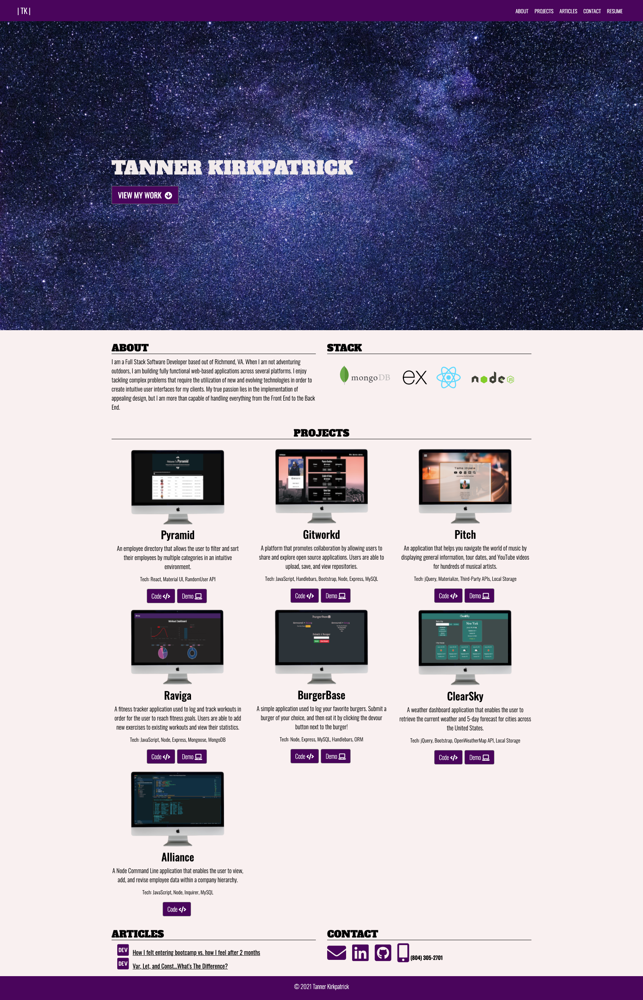
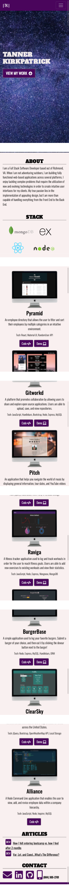

# react-portfolio

  

Updated portfolio featuring a modern design and single-page layout. Built with React and React-Bootstrap.

View my deployed portfolio <a href = "https://www.tannerkirkpatrick.com">here</a>

## Table of Contents

- [Screenshots](#screenshots)
- [Resources](#resources)
- [Questions](#questions)
- [License](#license)

## Screenshots

#### Desktop

#### Mobile

## Resources

**React**  
**Bootstrap/React-Bootstrap**  
**Photopea**  
**Vector Logo Zone**  
**Font Awesome**  
**Google Fonts**

## Questions

If you have any further questions, feel free to reach out to me!  
<a href='https://www.github.com/twkirkpatrick'>Github</a>  
<a href='mailto:twk4491@gmail.com'>twk4491@gmail.com</a>

## License

Usage is provided under the MIT license.
